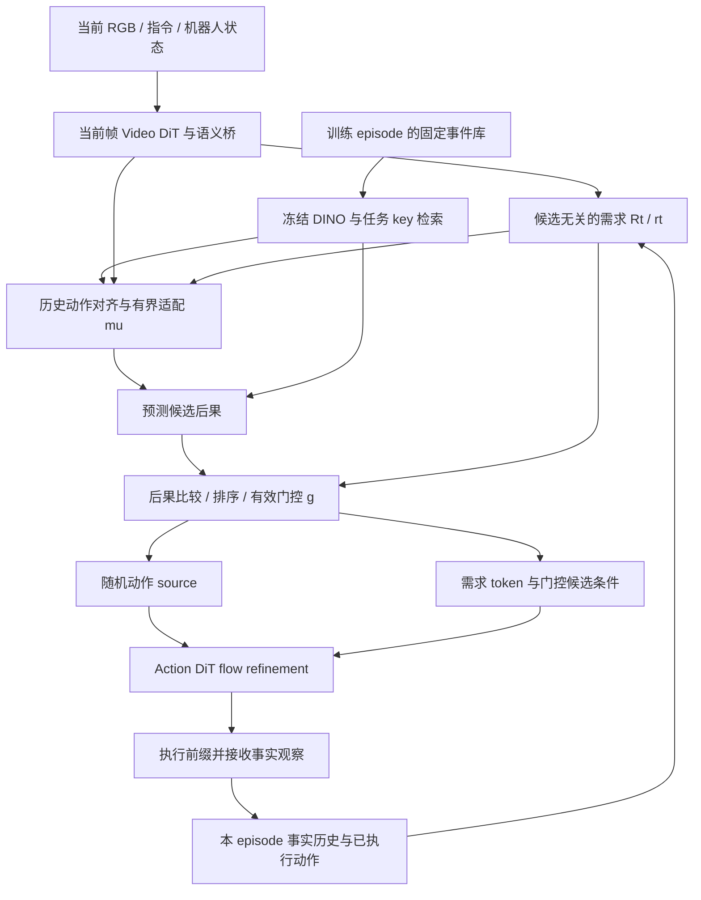

# WARM 论文、实现与实验证据首轮审查

审查日期：2026-09-21。结论适用于本次读取的本地源码；不代表服务器版本或已发表结果的复现。

## 1. 结论与证据边界

WARM 已有实质性的模型、数据、训练与在线执行实现。论文的主链路可以在代码中定位：候选无关的任务需求预测、历史动作适配、后果比较、统一门控、随机 source 与 Action DiT refinement。当前最优先的工作是对齐实验定义和补齐结果来源，使已有系统能够产生可归因的证据。

本次完整阅读了提供的 35 页论文（正文、参考文献、附录与待填实验协议），渲染了全部页面并目视检查主要方法图、公式与关键表格；沿核心调用链审查了训练、推理、辅助监督、因果历史、候选检索、实验开关和部分 checkpoint/provenance 逻辑。**这不是全仓每个文件的逐行审计，也不是完整分布式训练或硬件验证。**

用户已确认：本地只有论文中的汇总数，没有对应的逐 episode 结果、训练配置导出和 checkpoint。代码中的历史状态文档只作为历史记录，不被当成本轮服务器实测。

| 对象 | 本轮可确认 | 本轮不能确认 |
|---|---|---|
| 论文方法 | 机制、公式、待验证假设和证据边界 | 方法在真实已训练模型上的有效性 |
| 核心实现 | 下文列出的具体静态路径；172 项相关测试通过 | Torch 模型行为、真实梯度、CUDA/DeepSpeed 数值稳定性 |
| LIBERO 98.7% | 论文与本地结果文档的汇总算术一致 | checkpoint 身份、逐任务原始结果、失败分母、seed 配对 |
| RMBench 83.9% | 论文所报任务数可算得 755/900 | 原始 rollout、实际数据预算、shared/specialist 身份 |
| 消融与五轮干扰 | 论文陈述及 pending 标记 | 独立重训与推理干预的行级归因、实际 donor 协议 |
| 真机 | 论文给出未完成的协议 | 机器人标定、控制语义、可执行 checkpoint、闭环成功率 |

本轮没有运行 Git 命令，没有启动训练、模拟器或机器人，没有修改模型/训练/评测实现。仓库新增文件仅为本报告。临时 PDF 渲染与审查快照位于仓库外。

## 2. 研究问题与方法理解

研究问题是：当前画面不足以决定下一步时，如何利用本 episode 的事实历史，判断另一个 episode 中的行为现在是否适用，并控制其对动作生成的影响。

三个可区分的假设：

1. **Q1：历史证据有用。** 当前 episode 的观察与已执行动作，能帮助判断当前任务需要的变化；跨 episode 动作范例不能替代这部分信息。
2. **Q2：后果比较有用。** 历史事件视觉相似，不代表其动作在当前阶段合适。适配动作的预测后果与候选无关的需求比较，应比仅依赖检索/排序更能辨别适用性。
3. **Q3：生成先验有用。** 把适用的动作结构放进 flow source，可能比仅增加条件 token 更有效；门控关闭时需要撤销 source 和候选条件两条路径。

当前主路径属于示范驱动的监督式动作 flow matching，辅以后果、排序和 gate 学习。已审查路径没有基于环境 reward 的 actor-critic 更新、Bellman target 或 imagined replay RL；不能因项目使用 world model 就将其描述为 model-based RL。



这里的 `rt` 是在示范后果监督下学习的任务条件预测，不是外部真值子目标；预测候选的后果也不是已证实的反事实物理模拟。

### 实际数据接口

| 项目 | LIBERO 配置 | RMBench 配置 |
|---|---|---|
| action / proprio 宽度 | 7 / 8 | 14 / 14 |
| 动作预测长度 | 32 | 32 |
| 典型执行前缀 | 10 | 4 |
| 单相机处理尺寸 | 224 × 224，两路 | 240 × 320，三路 |
| VAE 前拼接图像 | 224 × 448 | 384 × 320，上方 head、下方双腕 |
| 检索 key | 768 DINO CLS + 40 task one-hot | 768 DINO CLS + 9 task one-hot |
| 动作对齐 | 相对动作不平移 | 绝对关节动作加当前/历史起点偏移，夹爪不平移 |

一个容易误读的细节：两套配置均从 33 个原始观察位置与 32 个动作构造窗口，但 `action_video_freq_ratio=4` 会把视频抽样为 **9 帧**；动作仍为 32 步。不能将配置中的 `num_frames=33` 直接称为实际 Video DiT 输入 33 帧。[数据抽样与拼图实现][dataset-video]、[LIBERO 配置][libero-data]、[RMBench 配置][rmbench-data]。

任务 one-hot 是闭集任务身份。跨 episode 检索不等于跨任务或跨 embodiment 泛化；真机组合任务还需要单独说明 target-task key 和来源事件的可访问范围。

## 3. 论文机制发生在代码的哪里

| 论文机制 | 实现位置 | 本轮判断 |
|---|---|---|
| 完整 state-action-effect 事件 | [bank_builder][bank-build]，保存 `actions[start:stop]`、边界特征和 provenance | 有实质实现；真实 bank 内容未提供 |
| 排除 query episode / 重复内容 | [EventBank.search][bank-search] | 支持 episode、source hash 和 feature hash 排除；不是仅排除同一窗口 |
| 因果训练历史 | [离线 prefix replay][prefix-replay] | 先保存 query 可见历史，再写入该时刻事实；未来目标单列 |
| 在线事实提交 | [OnlineEpisodeController][controller]、[RMBench replan][rmbench-replan] | 先读历史、推理，再提交当前观察与此前已执行前缀；新生成后缀不写成事实 |
| 候选无关需求，式 (2) | [required_gist 调用][requirement] | event tensor 置零且 event mask 全 false |
| 固定后果描述符，式 (13) | [spatial effect summary][effect-summary] | 变化能量加权，加 0.05 的 pre-state 项 |
| 动作适配与后果预测，式 (4)-(5) | [RetrospectiveEventAdapter][effect-head] | 后果头使用 adapted action 的均值/末值/绝对变化量、历史 effect、当前 world |
| 后果比较，式 (6) | [consequence_consistency][consistency] | cosine 减 log-norm 差异 |
| 排序与绝对 gate | [选择和 gate][selection-gate] | 排序与 gate 分开；effective gate 另含 repetition、时序 eligibility 和推理阈值 |
| source，式 (8) | [source 构造][source-path] | `g*(mu+sigma_min*eps)+(1-g)*eps`，复用同一 Gaussian draw |
| 两条候选通路共同撤销，式 (9) | [条件融合][condition-path] | gate detach；action-context 在线性投影后整体乘 gate，包含投影 bias |
| flow endpoint detach，式 (10)-(11) | [build_action_flow_pair][flow-pair]、[scheduler][scheduler] | source detach 后用于加噪与 `source-action` 速度目标；推理向 sigma=0 积分 |
| 视频训练隔离 | [training_loss_video_only][video-loss] | video-only forward 不构造 Action DiT tokens |
| 辅助监督与 mask | [auxiliary losses][aux-loss] | 固定 ranking labels、缺未来 mask、hard-negative gate target、candidate/adaptation 排除 |
| shared / specialist 训练范围 | [trainable scope][train-scope]、[specialist 冻结][specialist-scope] | shared 训练 Action DiT；specialist 冻结其参数，仅调整相关适配模块 |

训练目标对应 `L_action + lambda_video*L_video + L_rank/bridge/req/effect/gate/adapt`，不是 reward 最大化。排名 soft label 来自对齐后的事实动作与存储 effect 对示范的误差，并 detach；gate target 则会随当前适配动作和预测后果变化，detach 仅阻断当次目标的梯度。

一个应明确记录的梯度边界：当前帧 `_prefill_action_conditioning` 整体位于 `torch.no_grad()` 内。因此 action/retrospection loss 不会沿该 prefill 回传到 video adapters；video adapters 在独立 video-only loss 中获得训练信号。语义桥、需求/事件模块和可见条件路径仍可学习。此处是已检查实现的事实，不自动判为 bug；若要主张 action loss 直接塑造 video adapters，需要另行设计并做梯度测试。[prefill][prefill]

`g=0` 意味着当前候选撤销，仍保留已训练 WARM 的需求与历史条件；不等于恢复未经适配的 FastWAM。论文命题的数值验证还必须固定事实输入、mask、token 数与 solver randomness。

## 4. 优先处理的问题

### A. 论文消融与当前实验开关不等价（高优先级，已确认）

**设计预期：** 论文 Table 8 的 no explicit comparison 只移除选择与 gate 输入中的 `kappa`，保留 effect features、effect supervision、动作适配以及 source/conditioning 两条路径。匹配重训时，训练与部署使用相同干预。

**当前实现：** 仅登记 `full / context_only / source_only_no_consequence` 三种在线模式。`source_only_no_consequence` 还会清零历史 effect 输入并将整个附加 conditioning 设为 `None`。此外，训练分支无条件设置 `ablation_mode="full"`；在线开关不会改变优化语义。[模式定义][mode-def]、[训练分支][train-control]、[候选处理][requirement]、[条件分支][condition-path]

**差异与影响：** 现有 source-only 对照同时改变多个机制，不能归因于显式后果比较；`context_only` 是现有 checkpoint 的推理干预，不能直接标为独立重训。当前已检查入口没有论文完整六行 store-access controls。

**推荐：** 增加可序列化、进入 checkpoint/训练证明的实验语义配置，分别控制 recollection、repertoire、comparison、source。保留现有在线干预并标记类型 `I`；匹配重训标记 `T`；旧汇总保留 `U`。默认 full 行为不变。Repertoire-only 必须同时清除历史 query、repetition、continuity cursor，避免暗中保留短期信息。

### B. 现有 corruption 不能复现论文完整事件干扰（高优先级，已确认）

**设计预期：** 论文保留一半正常候选，其余替换为完整训练事件；donor 的动作、pre-state、effect、timing、provenance 一起替换，记录实际 replacement/eligibility coverage。

**当前实现：** `reversed_action` 反转动作时间顺序；`phase_shift` 滚动动作/修改 timing；`effect_mismatch` 对 effect delta 取负；`wrong_event` 在已有候选中强制选择另一个 slot。这些均不等于从库中替换一半完整 donor 事件。[corruption 实现][corruption]

**影响：** 当前矩阵不能直接作为论文 Figure 3/Table 14 的复现脚本；单独改动作或 effect 还会破坏事件的事实一致性。它们可保留为独立 stress tests。

**推荐：** 在候选构造层实现完整事件替换，而非模型内部修改部分 tensor。候选内容哈希需要绑定替换后的事件；同时覆盖 successor lane，并记录原 donor 身份、保留 slot 规则、随机 seed、替换不足与硬规则淘汰。当前未找到可对应论文 random/similar 完整事件干扰的实现。

### C. 汇总结果尚未闭合证据链（高优先级，证据缺失）

汇总算术已复算：LIBERO `1974/2000=98.7%`；RMBench M(1) `406/500=81.2%`、M(n) `349/400=87.25%`，整体 `755/900=83.888...%`。类别均值需要按 5 与 4 个任务加权，不能各占一半。

这只说明所报数字内部相容。没有逐 episode 结果就不能确认失败是否保留、seed 是否一致、训练集是否合规，也不能从边际均值/SD 恢复 paired contrast 的不确定性。五轮评测不能称为五个独立训练 seed。

论文 Table 7/9/10/12 与机制表格已经标记 pending，应保留。主表、消融、干扰的每一行需要独立指向：实际源码标识、checkpoint hash、解析配置、训练/开发 split、数据与 bank hash、训练阶段及步数、评测 reset IDs、全部成功/失败/排除记录。找不回的旧结果只能保留为未核验汇总，或用预先固定的新协议重新产生。

### D. 运行源码与训练证明可能脱节（高优先级，已确认的工程风险）

`acp_warm_libero.sh` 默认 `ALLOW_DIRTY_WARM_TRAINING=true`，随后设置 `allow_unattested_warm_checkpoints=true`；Trainer 因此跳过正式 `.training.json`。正式 LIBERO eval 又需要读取该 sidecar。[默认值][launcher-default]、[override][launcher-override]、[Trainer 分支][attestation-bypass]

即使启用 attestation，当前 `clean_git_commit()` 只读 HEAD，读取失败则写 40 个零；当前证明字段没有覆盖工作树源码内容的哈希。评测启动器在 commit 本地存在时尝试创建该 commit 的 detached worktree。因此训练若使用了未提交修改，单靠 commit 无法证明评测代码与训练实现一致。[commit 采集][commit-capture]、[评测代码选择][eval-code]

**推荐：** 遵守本仓库“本地 checkout 原样运行、允许 dirty、无 origin 探测”的规则，增加实际 source/config/launcher 内容清单与哈希、依赖/环境指纹，并作为运行身份保存；不要通过重新引入 clean-tree 拒绝来解决。缺少历史证明时不得给旧 checkpoint 补造训练事实。精确复现旧行为需要明确源码快照与兼容补丁的关系。

### E. effect head 的辨别力尚未被证明（核心科研风险，非已观察到的失败）

代码与论文式 (21)-(22) 基本相符：事实调用使用 GT action 和零历史 prior；候选调用则把每个候选拉向同一 query future effect，只是 utility 权重不同。[候选监督][aux-loss]

因此“所有候选都预测 query 的后果”是候选正则本身不能排除的解。后果头还只看动作的均值、末值和平均绝对差分，不能保留所有动作时序。论文已经诚实讨论这些限制；代码 docstring 中“identifiable ... without counterfactual labels”的措辞则过强。[effect head][effect-head]

**推荐：** 先做候选分支实测再改结构。对同一完整模拟器/控制器/RNG 状态逐一执行 adapted proposal 的 H=32 步，比较 `predicted effect / historical effect / query-only requirement`。正常 4-step replan 的轨迹不能充当 H32 的 proposal outcome。报告 endpoint coverage、早终止/失败、tie-aware ordering、独立 applicability 标签；若只有总体 MSE 改善而没有候选排序改善，应收窄机制 claim。

### F. 数据预算、模型身份和文档存在漂移（需固定协议）

论文报告每任务 50 demos；当前 `sota_v1.json` 的 shared 默认却为 `scale200-dev190`，同时存在 shared 到 specialist 的训练链和任务特定 NFE/K。该默认值不证明论文实际使用了额外数据，但不能用它直接复现“50-demo 同预算”结果。[训练注册表][sota-registry]

旧架构文档仍描述 stored-effect residual 初始化与“各事件自身事实 effect”监督，当前代码已是预测 MLP、零 prior 的 query factual loss 和 query-target candidate regularizer。文档中的“33-frame video-only backward”与当前抽样后 9 帧也需澄清。以当前源码与实际导出的配置核对，而不是选择对论文最有利的一版文字。

## 5. Claim 到最小实验的路线

以下均是建议的后续实验，未执行，不预设 WARM 获胜。先使用 Put Back Block 与 Press Button 检验原干扰结论的机制；该子集结果不能替代九任务主表。

| 优先级 / ID | Claim 与假设 | 实验与控制 | 指标与所需证据 |
|---|---|---|---|
| P0 / E0 | 每个数字对应真实、可追溯运行 | 为论文行建立 T/I/U ledger；不能恢复的行标 pending | 每行完整 provenance；成功/失败分母；无混用预算 |
| P1 / E1 | 公式和因果边界正确落地 | Torch 小模型：固定事实、候选替换、双路径 forced-null；未来目标只影响监督；按 loss 分别 backward | action 最大误差对重复调用容差；mask 不变；梯度到达/阻断清单 |
| P1 / E2 | 基础控制链可学、可执行 | 一个任务 1 条及 5 条示范过拟合；专家 qpos 回放；短训练保存/恢复；少量固定 reset | 动作误差、夹爪时机、关节实际运动、loss/grad 有限、恢复连续性 |
| P2 / E3 | 后果头区分候选，而非只拟合 query | 预选 held-out prefixes；恢复完整状态后执行每个 mu 的 H32；对照历史 prior 和 query-only | effect MSE、tie-aware pair score、独立 top-choice applicability、覆盖率，按 episode 聚类 |
| P2 / E4 | learned gate 确实拒绝不适用行为 | 复用 E3 标签，区分 raw alpha、effective g 与 deterministic eligibility；空库、合法但不适用池 | eligible false/true acceptance、硬 veto 比例、未知标签覆盖、paired SR 差值 |
| P3 / E5 | 显式 comparison 降低错误经验代价 | 只移除 kappa 的匹配重训；clean/random/similar 完整事件替换，共同 reset 计划 | SR、normal-to-similar degradation 差及 paired interval；实际替换率 |
| P3 / E6 | source 收益来自动作内容 | 匹配训练比较 eps、c(g)*eps、g*mu+c(g)*eps，条件规则/NFE/预算一致 | SR、实际 gate 与 noise-scale 分布；另做固定 prefix/固定 gate/noise 的局部诊断 |
| P3 / E7 | 事件历史优于同信息近期缓存 | 相同 history token/已执行动作/任务信息预算的重训；critical 与 noncritical record removal 局部干预 | SR、requirement error、正确下一步选择；不把任意历史交换当因果证据 |
| P4 / E8 | 主表表现与泛化/效率成立 | 冻结配置后全 benchmark、独立训练 seed；单独记录 shared/specialist；匹配预算比较 | task-balanced SR、counts、seed 方差与 paired interval；端到端 median/p95 延迟与显存 |

E3 与 E4 共用一份分支执行数据，比为每个问题单独生成 rollout 更有价值。试点可先固定两任务、每任务 10 个来自 held-out episode 的 prefix、每 query 最多 8 个候选，最多 160 个 H32 分支；只用于验证记录与辨别力，不作正式显著性结论。正式样本量应根据 pilot 的 episode 级方差与目标精度提前确定。

E6 的噪声匹配很必要：`c(g)=1-g+g*sigma_min`，source 与 GT 更近可以仅由噪声缩小造成；不能直接推出动作范例有效、ODE 更直或 NFE 可以减少。不同重训模型的 gate 分布也可能不同，必须同时报告。

同信息强基线优先做一个 history-aware retrieval-residual comparator，复用现有事件数据和动作接口；其价值是区分“更多信息/动作范例”与“显式后果准入”。先不叠加大量新网络或引入 RL 更新，以免同时改变核心假设。

## 6. 推荐工程顺序与验收条件

1. **运行身份与证据登记。** 先修复 source snapshot/attestation 衔接；允许 dirty、离线运行。新增结果登记和聚合时，只有可验证记录才能进入正式统计。旧汇总不冒充新证据。
2. **实验语义配置。** 把训练与部署共同的组件干预写入不可变配置；runtime-only 干预保留独立类型。用等价性测试确认 full 默认未变、no-comparison 只变 kappa、repertoire-only 真正清除了所有历史支路。
3. **完整事件干扰与诊断出口。** 保留已有 retriever/bank/controller 边界，追加 donor 替换与 raw/effective/veto 记录；不要将 donor 的 provenance 与原候选混用。
4. **候选分支诊断。** 在 simulator wrapper 内实现状态恢复验证和 H-step proposal 执行；不把诊断真值接入在线策略。先重放同一动作两次检验恢复一致性，再评估 effect/gate。
5. **通过小闭环后才扩大计算。** shared/specialist、数据 profile、loss 权重、NFE 与执行前缀均来自解析配置；模型选择只读 dev，正式测试不用于挑 checkpoint。

推荐以少量显式配置和函数扩展现有模块，不为本次研究另建通用 Agent/RL 框架。比较三条路线：直接全量重训成本高且仍缺归因；先改 effect 网络有监督目标与 checkpoint 兼容风险；**先补协议、身份与诊断**侵入较小，而且能决定是否确实需要改模型。

## 7. 本轮验证与复跑命令

本机 `C:/Softwares/Miniconda3/python.exe` 可执行 pytest，但没有 PyTorch。所有执行均设置 `PYTHONDONTWRITEBYTECODE=1` 并关闭 pytest cache。

| 测试组 | 结果 | 覆盖 |
|---|---|---|
| action contract、event mining、candidate selection、corruption curriculum、episode memory/controller、retrospection config，加 4 个 Torch 模块 | 133 passed / 4 skipped | 纯 CPU 合约与因果状态机；Torch 模块整体跳过 |
| bank builder、candidate cache、runtime candidates、retrospective dataset、online episode memory、evidence analyzer | 39 passed / 1 skipped | 候选产物、事实历史、证据统计；dataset Torch 模块跳过 |
| 合计 | **172 passed / 5 skipped** | 无训练/闭环/真机性能含义 |

准确复跑本轮两个测试组（在仓库根目录的 PowerShell）：

```powershell
$env:PYTHONDONTWRITEBYTECODE='1'
python -m pytest -q -p no:cacheprovider tests/test_action_contract.py tests/test_event_mining.py tests/test_candidate_selection.py tests/test_consequence_curriculum.py tests/memory/test_episode_memory.py tests/test_online_episode_controller.py tests/test_warm_retrospection_config.py tests/test_source_transport.py tests/test_consequence_torch.py tests/test_warm_retrospection_model_torch.py tests/test_warm_video_cotraining_torch.py
python -m pytest -q -p no:cacheprovider tests/test_bank_builder.py tests/test_candidate_cache.py tests/test_runtime_candidates.py tests/test_warm_retrospective_dataset.py tests/memory/test_online_episode_memory.py tests/test_analyze_warm_rmbench_evidence.py
```

已有依赖齐全的 Linux Torch 环境中，下一步可先跑以下命令；这是待执行命令，不是本轮结果：

```bash
WARM_REQUIRE_TORCH_TESTS=1 PYTHONDONTWRITEBYTECODE=1 PYTHONPATH=src:. \
python -m pytest -q -p no:cacheprovider \
  tests/test_source_transport.py \
  tests/test_consequence_torch.py \
  tests/test_warm_learned_adapters_torch.py \
  tests/test_warm_retrospection_model_torch.py \
  tests/test_warm_video_cotraining_torch.py \
  tests/test_warm_retrospective_dataset.py
```

这些现有测试还不能代替完整 solver 的 forced-null 误差验证、分布式 resume smoke 或实际候选执行结果。

## 8. 本轮审查身份与来源

论文 SHA-256：`b1f5d91da26dc5fef3a9560826f3a3329946cd0c79a7f2425dda6a2b3a8b5931`。

已保存 363 个源码/配置/测试/入口文件的内容清单，清单摘要为 `29998a30ed1cffcc556939f95b5a41455f40c1c8a21a5e6e2c8cff301257650a`。**哈希清单不表示逐行审查了全部 363 个文件。** 未查询 Git commit；该快照仅标识当前审查上下文，不是训练证明。

- [源码快照清单](C:/Users/admin/.codex/visualizations/2026/09/21/01a0c353-7ccc-7c51-9310-339904508ea2/warm_audit/source_snapshot.json)
- [所报计数的算术复核](C:/Users/admin/.codex/visualizations/2026/09/21/01a0c353-7ccc-7c51-9310-339904508ea2/warm_audit/reported_count_arithmetic.json)

外部原始来源仅作背景核对：[Fast-WAM v2](https://arxiv.org/abs/2603.16666v2) 将训练期视频建模与测试期未来生成分开；[RMBench](https://arxiv.org/abs/2603.01229) 原始论文明确以九项记忆依赖任务评测记忆能力。未在本轮重新审计 WARM 表格中所有外部 baseline 的具体数值、实现与预算；论文明确区分跨论文公开参考值和内部匹配对照，这个边界应继续保留。

[dataset-video]: C:/Users/admin/Downloads/slai_download/WARM/src/fastwam/datasets/lerobot/robot_video_dataset.py:196
[libero-data]: C:/Users/admin/Downloads/slai_download/WARM/configs/data/libero_2cam.yaml:28
[rmbench-data]: C:/Users/admin/Downloads/slai_download/WARM/configs/data/rmbench_3cam.yaml:27
[bank-build]: C:/Users/admin/Downloads/slai_download/WARM/src/fastwam/memory/bank_builder.py:285
[bank-search]: C:/Users/admin/Downloads/slai_download/WARM/src/fastwam/memory/event_bank.py:262
[prefix-replay]: C:/Users/admin/Downloads/slai_download/WARM/src/fastwam/datasets/warm_retrospective.py:341
[controller]: C:/Users/admin/Downloads/slai_download/WARM/src/fastwam/memory/online_episode_controller.py:157
[rmbench-replan]: C:/Users/admin/Downloads/slai_download/WARM/experiments/rmbench/warm_policy/deploy_policy.py:922
[requirement]: C:/Users/admin/Downloads/slai_download/WARM/src/fastwam/models/warm/retrospection_model.py:1410
[effect-summary]: C:/Users/admin/Downloads/slai_download/WARM/src/fastwam/models/warm/retrospection_model.py:276
[effect-head]: C:/Users/admin/Downloads/slai_download/WARM/src/fastwam/models/warm/retrospective_event_adapter.py:235
[consistency]: C:/Users/admin/Downloads/slai_download/WARM/src/fastwam/models/warm/consequence.py:582
[selection-gate]: C:/Users/admin/Downloads/slai_download/WARM/src/fastwam/models/warm/retrospection_model.py:1475
[source-path]: C:/Users/admin/Downloads/slai_download/WARM/src/fastwam/models/warm/retrospection_model.py:1620
[condition-path]: C:/Users/admin/Downloads/slai_download/WARM/src/fastwam/models/warm/retrospection_model.py:1646
[flow-pair]: C:/Users/admin/Downloads/slai_download/WARM/src/fastwam/models/warm/source_transport.py:398
[scheduler]: C:/Users/admin/Downloads/slai_download/WARM/src/fastwam/models/wan22/schedulers/scheduler_continuous.py:49
[video-loss]: C:/Users/admin/Downloads/slai_download/WARM/src/fastwam/models/wan22/fastwam.py:817
[aux-loss]: C:/Users/admin/Downloads/slai_download/WARM/src/fastwam/models/warm/retrospection_model.py:1730
[train-scope]: C:/Users/admin/Downloads/slai_download/WARM/src/fastwam/models/warm/retrospection_model.py:803
[specialist-scope]: C:/Users/admin/Downloads/slai_download/WARM/src/fastwam/trainer.py:998
[prefill]: C:/Users/admin/Downloads/slai_download/WARM/src/fastwam/models/wan22/fastwam.py:619
[mode-def]: C:/Users/admin/Downloads/slai_download/WARM/src/fastwam/models/warm/retrospection_model.py:94
[train-control]: C:/Users/admin/Downloads/slai_download/WARM/src/fastwam/models/warm/retrospection_model.py:1183
[corruption]: C:/Users/admin/Downloads/slai_download/WARM/src/fastwam/models/warm/retrospection_model.py:362
[launcher-default]: C:/Users/admin/Downloads/slai_download/WARM/scripts/acp_warm_libero.sh:140
[launcher-override]: C:/Users/admin/Downloads/slai_download/WARM/scripts/acp_warm_libero.sh:846
[attestation-bypass]: C:/Users/admin/Downloads/slai_download/WARM/src/fastwam/trainer.py:457
[commit-capture]: C:/Users/admin/Downloads/slai_download/WARM/src/fastwam/models/warm/training_attestation.py:679
[eval-code]: C:/Users/admin/Downloads/slai_download/WARM/scripts/acp_warm_libero_eval.sh:152
[sota-registry]: C:/Users/admin/Downloads/slai_download/WARM/configs/rmbench/sota_v1.json:4
